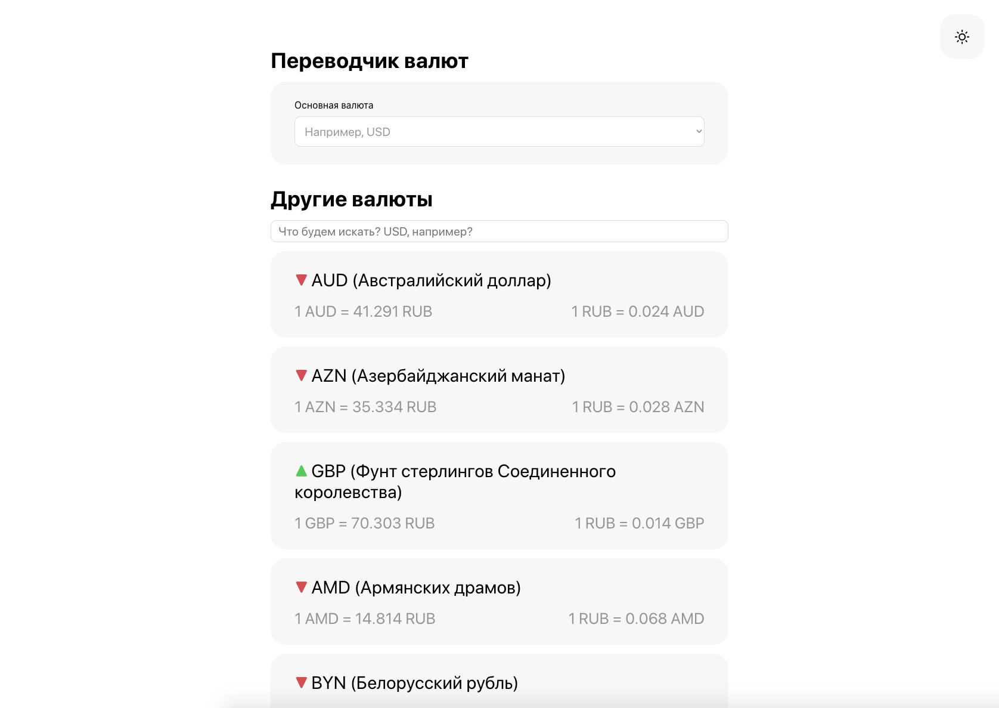
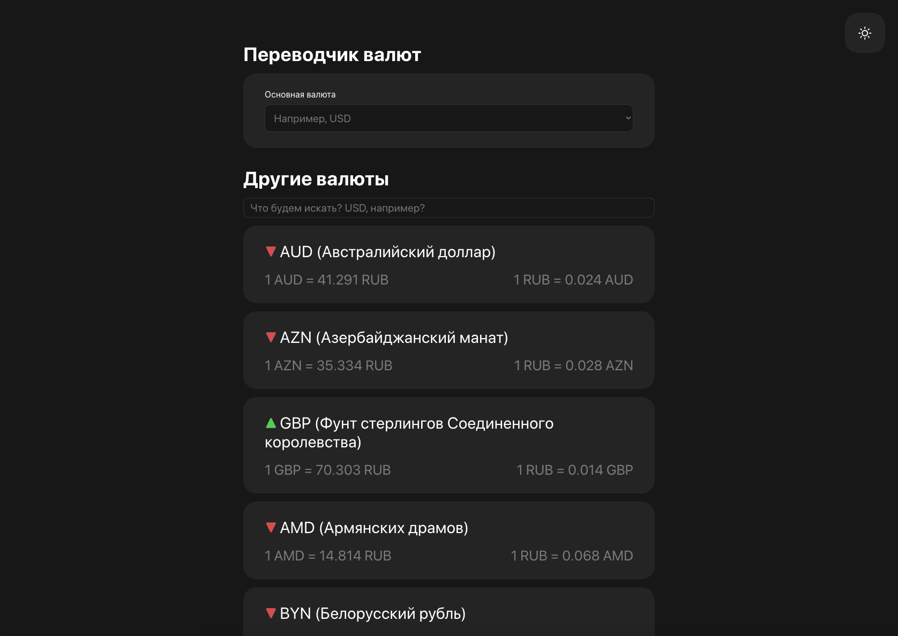

# Currency converter
Небольшой веб-сервис сделанный в рамках тестового задания.




## Стэк
- Vue 3 (Composition API)
- Pinia
- SCSS

## Фичи
- Выбор основной валюты и отображение ее курса
- Отображение других валют и их курсов
- Поиск среди списка "других валют"
- Темная и светлая тема :)


## Запуск проекта
```
npm i
npm run serve
```